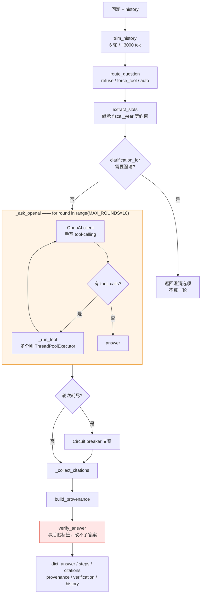
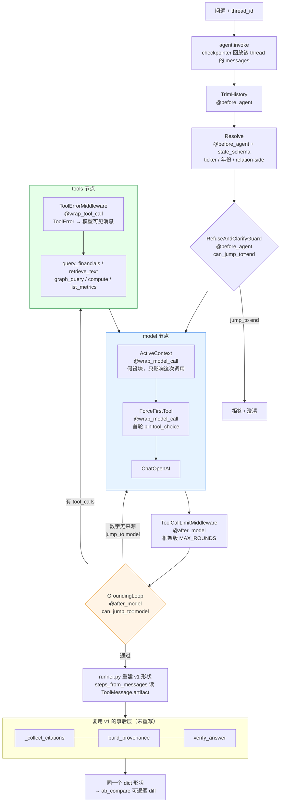
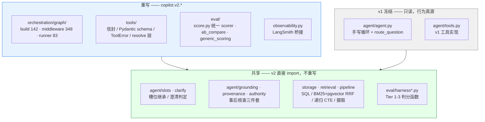
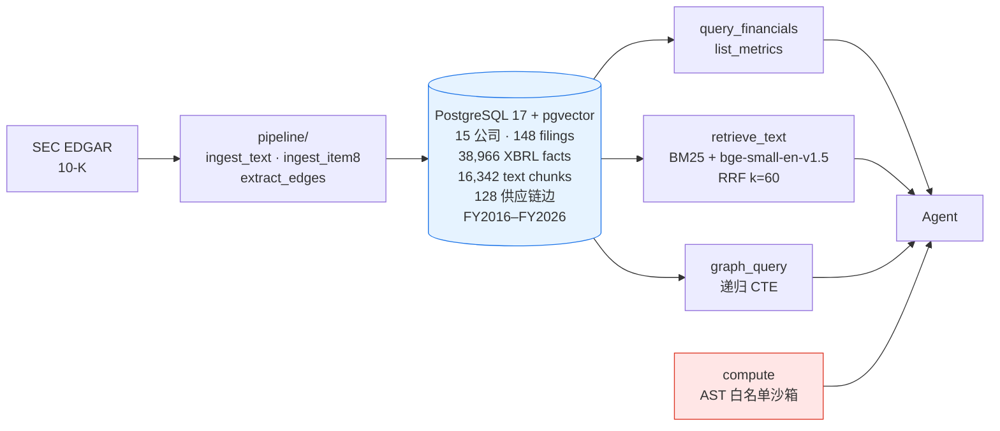
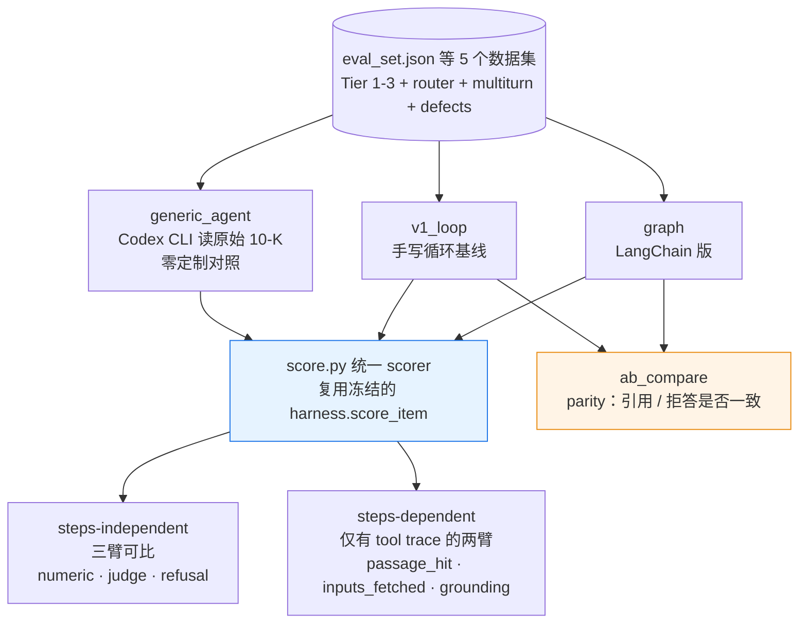

# Financial Report Copilot v2

一个针对 SEC 10-K 的财报研究 Agent。**v2 用 LangChain 1.x + LangGraph 重写了 [v1](https://github.com/renxiang-ch/Financial-Report-Research-Copilot) 的编排层与工具层**，v1 的手写 ReAct 循环原样冻结在仓库里作为**行为基线**，两者共用同一套数据、同一套评测尺子，可以逐题对比。

两个目标：

1. **学框架惯用法** —— 状态管理 / 工具调用 / 错误恢复 / 持久化 / 可观测 / 可扩展，六个维度的结算见 [`docs/devlog/008`](docs/devlog/008-langchain-refactor-retrospective.md)。
2. **把分析能力升级到公司级** —— 管理层指引兑现度、管理层风格分类、公司增长模式（Phase 4，进行中）。

---

## 运行图：v1 vs v2

这是整个项目最核心的一张对比。**同一个问题、同一批工具、同一个数据库**，区别只在编排。

### v1 —— 手写循环：策略在循环**外**跑一次



**结构性约束**：`verify_answer` 在循环**结束之后**才跑，所以它只能在答案上**贴标签**（"这几个数字没有来源"），无法让模型重做。要改这一点必须重写循环体本身。

### v2 —— `create_agent` + middleware：策略是挂在图**上**的 hook



**关键差别**：`verify_answer` 这个**同一个纯函数**挂到 `@after_model(can_jump_to=["model"])` 上，配一条回边，就从"事后贴标签"变成"退回重做"。**这是手写循环不重构自身做不到的事。**

> ⚠️ 诚实标注：这条回边在现有评测集上**从不触发**（`grounding_flagged` 本就是 0）。能力有了、单测证明了，但**评测价值为零** —— 见[为什么这是当前的瓶颈](#为什么下一步不是写代码)。

### 实测的 span 树（LangSmith）

上面那张图不是设计意图，是**实测**的。`scripts/smoke_langsmith.py` 把 trace 读回来：

```
LangGraph  2167ms
  └─ TrimHistory.before_agent  0ms             ← 1x   before_agent = 每轮一次
  └─ Resolve.before_agent  37ms                ← 1x
  └─ RefuseAndClarifyGuard.before_agent  1ms   ← 1x
  └─ model  1294ms
    └─ ActiveContext.wrap_model_call  1292ms   ← 2x   wrap_model_call = 每次调用
      └─ ForceFirstTool.wrap_model_call
        └─ ChatOpenAI  1287ms
  └─ GroundingLoop.after_model  0ms            ← 2x
  └─ tools  66ms
    └─ ToolErrorMiddleware.wrap_tool_call
      └─ query_financials  64ms
  └─ model  729ms  …（第二次模型调用，整组 per-call hook 重来一遍）
```

这棵树当场抓到一个 bug：`ToolRetryMiddleware` 曾经装反嵌套，**从未触发**，而 parity 闸门、绝对分闸门、173 个单测三层全部失明。详见 [devlog 007 §3.2](docs/devlog/007-phase3-maturity.md)。

---

## 哪些重写了，哪些没有



**领域逻辑逐字保留**：SQL、RRF 融合、递归 CTE、AST 沙箱全部从 `copilot.agent.tools` 原样拷过来。变的只有**信封、错误契约、schema、横切层** —— 这样 A/B 只比端到端，就能验证"接口变了、行为没变"。

---

## v1 机制 → v2 机制对照

| 关注点 | v1 怎么做 | v2 怎么做 | 收益 |
|---|---|---|---|
| **主循环** | `_ask_openai` 手写 `for round in range(10)` | `create_agent` 内建 model↔tools 循环 | 加能力 = 加一个装饰函数，不动主干 |
| **预路由** | `route_question` 在循环外跑一次 | `@before_agent` 三个 hook（框架原生"每轮一次"）| **手写"首轮守卫"从 5 处降到 2 处** |
| **假设块注入** | 拼进 prompt 字符串 | `@wrap_model_call` + `request.override(messages=…)` | **只影响这次调用**，不污染 state 历史 |
| **强制首轮工具** | `route["force_tool"]` 手传 | `@wrap_model_call` 改 `tool_choice` | 同上 |
| **多轮状态** | `conversation.py` append-only + `trim_history` | `thread_id` + checkpointer 回放 messages | 跨进程续答；slot 不重复存（是 messages 的纯函数）|
| **持久化** | 无，进程重启即丢 | `PostgresSaver` + `ConnectionPool` | **实测跨进程续答**：新进程只问"How dependent is it on Apple?"，继承 CRUS + FY2024 答 87.0% |
| **工具返回** | 5 个 shape 不一的 dict | `content_and_artifact` 二元组 | **input token −18%**（完整数据不进上下文）|
| **工具错误** | 手塞 `{"found":false,"recoverable":true}` | `raise ToolError(kind, hint, model_correctable, data)` + `ToolErrorMiddleware` | 错误分类学是领域知识，管道是框架的 |
| **参数约束** | docstring 里写给人看 | Pydantic `args_schema` + `metric` enum + validator | 非法值在进工具前被挡 |
| **ticker / 年份解析** | 散落各处 | `tools/resolve.py` 集中 + `@before_agent` 每轮一次 | **tier3 引用 6→8**，multiturn 引用变满 |
| **轮次熔断** | `MAX_ROUNDS=10` 手写计数 | `ToolCallLimitMiddleware(run_limit=12, thread_limit=40)` | 配置化，也是 Phase 4 fan-out 预算的种子 |
| **模型降级** | `model_router` 手写 | `ModelFallbackMiddleware` | **只在异常上切，不在答案质量上** |
| **grounding** | `verify_answer` 事后贴标签 | 同一函数挂 `@after_model(can_jump_to=["model"])` | 检测 → **纠正** |
| **可观测** | `langfuse` 只有配置字段，无代码 | LangSmith 原生 span（每 hook 一个）| 抓到三层闸门都测不到的 bug |
| **澄清** | 循环前 `clarification_for` 预判 | 暂仍是预判 | ⏸ 真 `interrupt()` 推到 Phase 5（无 UI 消费端）|

---

## 数据与检索



`compute` 是安全关键：**LLM 永不自己算数**，算术走 AST 白名单沙箱。`chunk = 500 tokens / overlap 50`（tiktoken `cl100k_base`），表格排除。

---

## 评测：三条臂，一把尺子



**两个闸门都要，不是二选一。** `ab_compare` 只回答"改动有没有引起行为变化"，对**两边一起错**和**内容错但引用对**结构上失明 —— 它作为唯一闸门跑了整个 Phase 1/2，期间 graph 身上带着两个真回归（EPS 6.08 显示成 `6`、检索文本丢 76%）。

### 实测数字（`eval_set.json` 30 题，同一 scorer）

| | generic_agent | v1_loop | **graph** |
|---|---|---|---|
| Tier1 可答 (17) | 100% | 100% | **100%** |
| Tier2 (10) | 100% | 100% | **100%** |
| retrieval judge | 2.57 | 2.57 | **2.57** |
| refusal | 0% (0/3)* | 100% | **100%** |
| input tokens | — | 208,695 | **170,758（−18%）** |
| 平均延迟 | 31.3s | 3.52s | **2.41s** |
| 成本/题 | ~$0.131 | ~$0.001 | ~$0.001 |

\* 那 3 道是"原始 10-K 能答、v1 schema 没有"，判错是 v1 口径所致，非能力问题。

完整历史见 [`docs/eval-history.md`](docs/eval-history.md)。

---

## 为什么下一步不是写代码

**三方在可答题上完全打平** —— 这个数据集**已饱和、无分辨力**。而且噪声底大于信号：

| 指标 | 三次观测 | 最小可分辨变化 | Phase 3 全部改动的可测效应 |
|---|---|---|---|
| retrieval judge | 2.57 / 2.43 / 2.57 | **±0.14**（7 题整数 judge，一题动 1 分 = 1/7）| **0** |
| citation 匹配 (67 组) | 62 / 58 / 59 | **±4** | **0** |

**连续三次"能力涨了但证明不了"**（检索改进、grounding 回边、3.4 的开关 A/B）。所以 Phase 4 的入场条件里三条是**证据**问题而不是代码问题：

1. **≥10 道 Tier 4 题**（现在 0 道）—— Phase 4 的退出标准是"Tier 4 rubric 均分达标"，**无法通过一个不存在的标准**
2. **扩 `undisclosed` 真陷阱题** 1 → 8~10 道（现在 n=1）
3. **数据 spike**：8-K Item 2.02（指引）+ XBRL 维度成员（分部）—— 语料是 **148 份纯 10-K**，而 10-K 里基本没有前瞻性指引，所以「指引兑现度」这一类**数据为零**
4. ~~3.2 LangSmith~~ ✅ 已完成

**先写题，再按题抓数据。** 10 道题写完会自己指出缺哪些数据，比抽象地问"数据够不够"有界得多。

---

## 快速开始

```bash
uv sync
cp .env.example .env          # 填 OPENAI_API_KEY + DATABASE_URL
uv run pytest -q              # 186 passed

# 问一个问题（LangChain 版）
uv run python -c "from copilot.v2.orchestration.graph import run; \
  print(run('What was Cirrus Logic revenue in fiscal 2024?')['answer'])"

# 绝对分 / parity 两个闸门
uv run python -m copilot.v2.eval.score --impl graph
uv run python -m copilot.v2.eval.ab_compare --dataset data/datasets/eval_set.json
```

可选开关（默认全关，保证评测可复现）：

| 环境变量 | 默认 | 作用 |
|---|---|---|
| `COPILOT_CHECKPOINTER` | `memory` | `postgres` = 会话跨进程存活 |
| `COPILOT_FALLBACK_MODELS` | 空 | 逗号分隔，主模型**报错**时依次尝试 |
| `COPILOT_GROUNDING_LOOP` | `1` | grounding 不达标是否退回重做 |
| `LANGSMITH_TRACING` | `false` | 开启后 `scripts/smoke_langsmith.py` 可读回 span 树 |

---

## 文档

| 路径 | 内容 |
|---|---|
| [`docs/devlog/README.md`](docs/devlog/README.md) | **实时状态单一真源** —— 里程碑表 + 文件索引 |
| [`docs/devlog/008-…`](docs/devlog/008-langchain-refactor-retrospective.md) | **LangChain 重构复盘** —— 六维度结算 + 13 条踩坑（每条标"为什么闸门没抓到"）+ Phase 4 入场条件 |
| [`docs/langgraph-migration-plan.md`](docs/langgraph-migration-plan.md) | Phase 0–5 路线图 |
| [`docs/dev-workflow.md`](docs/dev-workflow.md) | 六步开发循环 GOAL→INSPECT→PLAN→BUILD→EVAL→RECORD |
| [`docs/eval-history.md`](docs/eval-history.md) | 分数 / 延迟 / 成本历史，含噪声底推导 |
| [`docs/generic-agent-baseline.md`](docs/generic-agent-baseline.md) | 第三条臂：零定制通用 agent 读原始 10-K |

## 相关仓库

- [`renxiang-ch/Financial-Report-Research-Copilot`](https://github.com/renxiang-ch/Financial-Report-Research-Copilot) —— v1 源仓库
- [`renxiang-ch/Financial-copilot-handbook`](https://github.com/renxiang-ch/Financial-copilot-handbook) —— v1 配套讲解（pin 在 `v1.0-teaching`）
